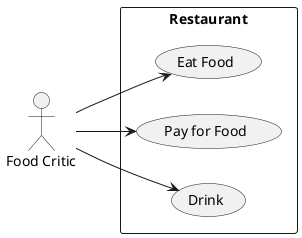

# Описание требований и архитектуры

## Введение
<!-- Общее краткое описание создаваемой системы -->
В рамках курса осуществляется проектирование решения на основе [постановки задачи от "заказчика"](../../task.md).

- [Описание требований и архитектуры](#описание-требований-и-архитектуры)
  - [Введение](#введение)
  - [Заинтересованные стороны](#заинтересованные-стороны)
  - [Бизнес-контекст (бизнес-требования)](#бизнес-контекст-бизнес-требования)
    - [Требования](#требования)
    - [Метрики](#метрики)
  - [Глоссарий](#глоссарий)
  - [Модель предметной области](#модель-предметной-области)
  - [Требования к системе](#требования-к-системе)
    - [Сценарии использования (Use case)](#сценарии-использования-use-case)
    - [Функциональные требования](#функциональные-требования)
    - [Нефункциональные требования/Требования к атрибутам качества](#нефункциональные-требованиятребования-к-атрибутам-качества)
    - [Ограничения](#ограничения)
  - [Архитектура](#архитектура)
    - [Журнал архитектурных решений](#журнал-архитектурных-решений)
    - [Контекст решения](#контекст-решения)
    - [Компонентная архитектура](#компонентная-архитектура)
    - [Реализация сценариев использования](#реализация-сценариев-использования)
    - [Программные интерфейсы](#программные-интерфейсы)
    - [Схема развертывания](#схема-развертывания)
  
## Заинтересованные стороны
<!-- Перечень заинтересованных сторон и их интересов по отношению к создаваемой системе. 
Подробнее: https://confluence.mts.ru/pages/viewpage.action?pageId=399975538 
-->
| Заинтересованная сторона | Интересы                                                             |
|:-------------------------|:---------------------------------------------------------------------|
| Докладчики               | Подать доклад и выступить с ним                                      |
| Зрители                  | Послушать выступления и задать вопросы докладчикам                   |
| Модераторы               | Организовать порядок в своём зале во время конференции               |
| Администраторы           | Подготовить расписание конференции и привлечь докладчиков и зрителей |
| Программный комитет      | Отобрать доклады и провести их ревью с выдачей рекомендаций          |
| Подразделение HR         | Улучшить узнаваемость бренда                                         |
| Event-отдел              | Владельцы бюджета                                                    |
| Юридический отдел        | Не допустить проблем с законодательством для компании из-за докладов |

## Бизнес-контекст (бизнес-требования)
<!-- Общее описание бизнес-контекста создаваемой системы (автоматизируемой деятельности), список бизнес-целей заинтересованных сторон 
Подробнее: https://confluence.mts.ru/pages/viewpage.action?pageId=399973845
-->
### Требования
1. Для максимизации числа докладчиков и зрителей необходимо организовать поддержку дистанционного участия в конференции
3. Для минимизации ручной работы при заведении докладчиков необходима самостоятельная регистрация на конференцию и подача докрада
4. Для минимизации ручной работы при заведении зрителей необходима самостоятельная регистрация
5. Для расширения аудитории за счёт дистанционных зрителей необходимо организовать трансляцию конференции на портале с возможностью задавать вопросы докладчикам и переключаться между комнатами
6. Для расширения круга потенциальных докладчиков за счёт дистанционных экспертов необходимо организовать возможность проведения доклада с личного устройства
7. Для максимизации числа докладов необходимо организовать простой процесс подачи и обновления докладов
8. Для оперативного проведения ревью необходимо организовать простой и удобный процесс работы с поданными докладами, поддерживающий уведомления об обновлениях после исправления замечаний
9. Для продвижения бренда необходимо иметь возможность добавлять информационные сообщения между докладами и во время них

### Метрики
1. Число регистраций в системе 15 000
2. Число обрабатываемых программным комитетом докладов 50
3. Число единовременно присутствующих на трансляции бользователей 10 000
4. Число залов 8

## Глоссарий
<!-- Содержит основные понятия и термины предметной области  
Подробнее: https://confluence.mts.ru/pages/viewpage.action?pageId=375782595
-->
| Понятие                        | Сокращение                         | Определение                       |
|:-------------------------------|:-----------------------------------|:----------------------------------|
| *Термин, обозначающий понятие* | *Сокращение термина (при наличии)* | *Развернутое определение понятия* |

## [Модель предметной области](data/data.md)

## Требования к системе

### Сценарии использования (Use case)
<!-- Подробное описание сценариев использования системы с привязкой к ролям участников и задействованным бизнес-сущностям 
https://confluence.mts.ru/pages/viewpage.action?pageId=375782108 
https://confluence.mts.ru/pages/viewpage.action?pageId=375782119 
-->
#### Диаграмма сценариев использования (Use Case Diagram) <!-- omit in toc -->

#### Список сценариев использования <!-- omit in toc -->

| ID     | Описание                                          |
|--------|---------------------------------------------------|
| UC.001 | *[Название сценария использования](uc/uc.001.md)* |

### Функциональные требования
<!-- Описание требований к функциям, реализуемым системой. Требование может быть привязано к сценарию использования или быть общим 
Подробнее: https://confluence.mts.ru/pages/viewpage.action?pageId=375782501 
-->
| ID     | Функциональное требование             |
|--------|---------------------------------------|
| FR.001 | Система должна из пользовательского интерфейса создавать аккаунт зрителя или докладчика и сохранять его данные |
| FR.002 | Система должна из пользовательского интерфейса создавать черновик доклада и сохранять его данные |
| FR.003 | Система должна из пользовательского интерфейса обновлять черновик доклада и сохранять его данные |
| FR.004 | Система должна из пользовательского интерфейса направлять черновик доклада на ревью |
| FR.005 | Система должна автоматически выбирать ревьюверов |
| FR.006 | Система должна автоматически направлять выбранным ревьюверам уведомление о новом докладе на электронную почту |
| FR.007 | Система должна из пользовательского интерфейса предоставить ревьюверу доклад к ознакомлению |
| FR.008 | Система должна из пользовательского интерфейса отклонять поданный доклад |
| FR.009 | Система должна из пользовательского интерфейса принять поданный доклад без замечаний |
| FR.010 | Система должна из пользовательского интерфейса фиксировать замечания к докладу и сохранять их данные |
| FR.011 | Система должна автоматически направлять авторам докладов уведомление о полученных замечаниях на электронную почту |
| FR.012 | Система должна из пользовательского интерфейса генерировать расписание докладов с учётом таймингов и перерывов |
| FR.013 | Система должна из пользовательского интерфейса изменить порядок докладов в рамках зала |
| FR.014 | Система должна из пользовательского интерфейса удалять доклад из расписания |
| FR.015 | Система должна из пользовательского интерфейса добавлять доклад в расписание |
| FR.016 | Система должна из пользовательского интерфейса заменять доклад в расписании |
| FR.017 | Система должна из пользовательского интерфейса публиковать расписание для зрителей и докладчиков |
| FR.018 | Система должна из пользовательского интерфейса открывать просмотр трансляции для выбранного зала |
| FR.019 | Система должна из пользовательского интерфейса подключать докладчика к участию в трансляции |
| FR.020 | Система должна из пользовательского интерфейса включать и выключать микрофон другим пользователям из роли модератора |
| FR.021 | Система должна из пользовательского интерфейса показывать чат модераторам, докладчикам и зрителям |
| FR.022 | Система должна из пользовательского интерфейса удалять сообщения в чате из роли модератора |
| FR.023 | Система должна из пользовательского интерфейса писать сообщения в чате из ролей модератора и зрителя |
| FR.024 | Система должна из пользовательского интерфейса вставлять в трансляцию информационные сообщения из роли модератора |
| FR.025 | Система должна из пользовательского интерфейса создавать заготовки информационных сообщений из роли HR-специалиста |

### Нефункциональные требования/Требования к атрибутам качества
<!-- Требования к основным архитектурным характеристикам (атрибутам качества) системы - надежность, масштабируемость, ИБ, и др.
Подробнее: https://confluence.mts.ru/pages/viewpage.action?pageId=375782530
-->
| ID     | Атрибут качества                   | Описание требования                       |
|--------|------------------------------------|-------------------------------------------|
| QR.001 | Доступность системы                | Доступность веб-приложения для регистрации и подачи доклада должна составить 99% |
| QR.002 | Доступность трансляции             | Доступность трансляции всех комнад во время проведения конференции должна составить 99.999% |
| QR.003 | Задержка трансляции                | Задержка видеопотока при трансляции не должна превышать 30 секунд |
| QR.004 | Восстанавливаемость системы        | В случае недоступности система должна автоматически восстанавливаться в течение 5 минут |
| QR.005 | Деградация системы                 | В случае превышения нагрузки во время трансляции допускается отказ в работоспособности функционала регистрации и подачи докладов |
| QR.006 | Производительность                 | Система должна поддерживать не менее 2500 слушателей на трансляции одного зала до начала деградации |

### Ограничения
<!-- Описываются ограничения, оказывающие влияние на архитектуру системы - временные, финансовые, технологические
Подробнее: https://confluence.mts.ru/pages/viewpage.action?pageId=375782592
-->
| ID     | Ограничение            |
|--------|------------------------|
| AC.001 | *Описание ограничения* |

## Архитектура

### Журнал архитектурных решений
<!-- Записи о ключевых принятых архитектурных решениях (ADR) для реализации архитектурно-значимых требований.
Подробнее: https://confluence.mts.ru/pages/viewpage.action?pageId=421162308
-->
- [ADR.NNN Суть решения](adr/adr-template.md)

### [Контекст решения](context/context.md)

### [Компонентная архитектура](components/components.md)

### Реализация сценариев использования
<!-- Реализация сценариев использования на основе взаимодействия компонентов системы и внешних систем/участников.
Диаграммы последовательности (UML Sequence diagram) и текстовое описание.

Подробнее: 
https://confluence.mts.ru/pages/viewpage.action?pageId=399442132
https://confluence.mts.ru/pages/viewpage.action?pageId=399442170
-->
| ID     | Описание                          | Реализация                                    |
|--------|-----------------------------------|-----------------------------------------------|
| UC.001 | *Название сценария использования* | [Реализация сценария](uc-impl/uc.001-impl.md) |

### Программные интерфейсы
<!-- Спецификации публичных API системы и ее компонентов (синхронных, событийных). Создается на основе модели предметной области для реализации сценариев использования. 
  Форматы: OAS/Swagger, GraphQL, AsyncAPI/CloudEvents
-->
| Компонент             | Интерфейс                                      |
|:----------------------|:-----------------------------------------------|
| *Название компонента* | *[Название интерфейса](api/service-name.yaml)* |

### [Схема развертывания](deployment/deployment.md)
